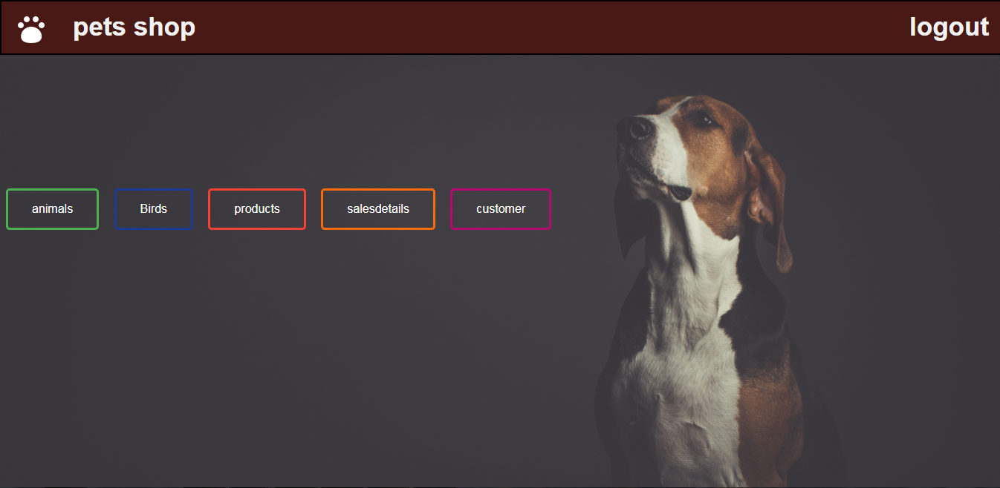
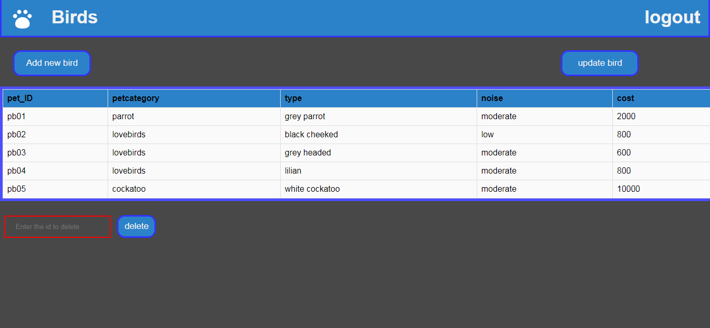

# **Pet Shop**
A mini database management system ,which helps the small scale petshop owner to keep track the available pet and it's products along with the sales details of his shop.

# Objectives
* To provide web based interface to a petshop owner to manage his petshop activities.

* To provide an option for storing and managing the basic information about pets and pet products in the shop.

* To provide an option for storing and managing the sales details of the shop.

* To provide an option for storing and managing the basic information about the customer.

* To track the information about sold pets and products to a customer.

# Developed with 

 **HTML**  **CSS**   **PHP**   **MYSQL**

# Description 

Full report <a href="./report/Full report.pdf">view </a>

## Screenshots 
* Login page

   

* Home page
  
  

* Animals page
   
   

* Birds page

  

* Pet Products page

  

* Sales details page 

  

* Customer page

  

* Add new Animal
  
  
  
